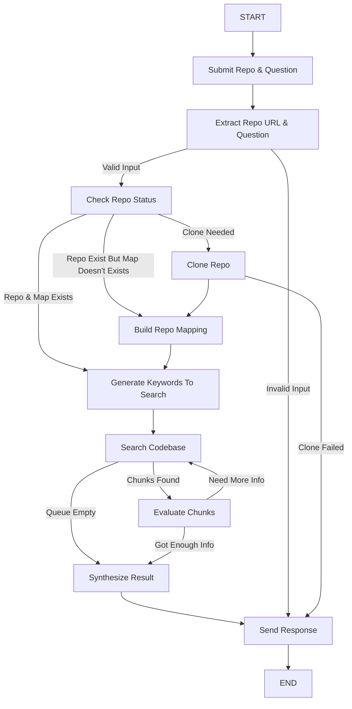

# Codebase Research Agent

A Django + LangGraph powered AI agent that can clone a GitHub repository, explore its source code, and answer implementation-specific questions by iteratively researching the codebase.

---

# Overview

Traditional code assistants often rely on embeddings, vector databases, or full-code ingestion into an LLM context window.

This project takes a different approach.

Instead of loading the entire repository into an LLM, the agent behaves like a software engineer performing code research:

1. Understand the user's question.
2. Identify the repository being discussed.
3. Build a lightweight map of the codebase.
4. Generate initial search hypotheses.
5. Search the repository for relevant symbols, files, and strings.
6. Extract only the most relevant code chunks.
7. Evaluate findings and decide what to investigate next.
8. Repeat until enough evidence is collected.
9. Synthesize a final answer with citations.

This allows the agent to answer questions about large repositories while keeping token usage manageable.

---

# Architecture

```text
User
 │
 ▼
Django API
 │
 ▼
LangGraph Agent
 │
 ├── extract_instructions_node
 │
 ├── check_existing_repo_node
 │
 ├── clone_repo_node
 │
 ├── build_repo_map
 │
 ├── generate_keywords_node
 │
 ├── explore_search_node
 │
 ├── explore_evaluate_node
 │         ▲
 │         │
 │         └──── exploration loop
 │
 └── synthesize_output_node
 │
 ▼
Final Answer
```

---

# Request Flow

Example request:

```text
How does authentication work in
https://github.com/example/project?
```

The request enters:

```python
POST /ask/
```

and is processed by:

```python
AskAPIView
```

which invokes the LangGraph agent.

---

# LangGraph Workflow

## 1. extract_instructions_node

Purpose:

Extract structured instructions from the user's request.

Input:

```text
How does authentication work in
https://github.com/example/project?
```

Output:

```python
{
    "repo_url": "https://github.com/example/project",
    "question": "Explain how authentication works"
}
```

The node also validates:

* GitHub repository URL exists
* Research question exists

If validation fails, the graph terminates early.

---

## 2. check_existing_repo_node

Purpose:

Determine whether the repository has already been cloned and indexed.

Checks:

### Database

```python
ClonedRepository
```

### Filesystem

```text
cloned_repos/
```

Decisions:

```python
should_clone
should_build_repo_map
```

Possible outcomes:

| Repository State       | Action     |
| ---------------------- | ---------- |
| Not cloned             | Clone      |
| Cloned but map missing | Build map  |
| Cloned and mapped      | Skip ahead |

---

## 3. clone_repo_node

Purpose:

Clone the repository locally.

Command:

```bash
git clone --depth 1 <repo_url>
```

Characteristics:

* Shallow clone
* Timeout protection
* Cleanup on failure
* Repository metadata stored in database

Output:

```python
{
    "repo_path": ".../cloned_repos/<uuid>"
}
```

---

## 4. build_repo_map

Purpose:

Create a lightweight representation of the repository.

Instead of loading source files into the LLM, the agent builds metadata.

Each file becomes:

```python
{
    "path": "...",
    "size": 1234,
    "language": "python",
    "docstring": "..."
}
```

Example:

```text
app/auth.py [python]
    Handles authentication

app/users.py [python]
    User management APIs
```

The node also determines:

```python
primary_language
```

Example:

```python
"python"
```

Results are stored in:

```python
ClonedRepository.repo_map
```

allowing future requests to skip rebuilding.

---

## 5. generate_keywords_node

Purpose:

Generate initial exploration targets.

Inputs:

* User question
* Repository map
* Primary language

Example output:

```python
[
    "AuthMiddleware",
    "authenticate_user",
    "JWT_SECRET",
    "auth/backends.py"
]
```

These become:

```python
search_queue
```

This queue drives the exploration loop.

---

# Exploration Loop

The core of the system is an iterative search-and-evaluate loop.

```text
search
  │
  ▼
evaluate
  │
  ▼
new targets?
  │
 ├─ yes ──> search again
 │
 └─ no ───> synthesize
```

---

## 6. explore_search_node

Purpose:

Locate code related to the current search target.

Example target:

```text
authenticate_user
```

Search method:

### Ripgrep

```bash
rg authenticate_user
```

Fallback:

```python
_python_grep()
```

if ripgrep is unavailable.

Results are ranked by file relevance.

---

### File Ranking

Files are ranked by:

```text
Number of matches
```

The most relevant files are processed first.

---

### Chunk Extraction

The search node delegates extraction to:

```python
extract_chunks()
```

which attempts to return the smallest meaningful code region.

---

# Chunk Extraction Strategy

## Python Files

Uses:

```python
ast.parse()
```

The extractor finds:

* Function
* Method
* Class

containing the matched line.

Example:

```python
def authenticate_user():
    ...
```

instead of returning hundreds of surrounding lines.

---

## Non-Python Files

Uses window extraction.

Example:

```text
40 lines above
40 lines below
```

around the match.

---

## File Path Targets

When the target is:

```text
auth/backends.py
```

the file itself is loaded and returned as a chunk.

---

## Output

Chunks become:

```python
{
    "file": "...",
    "lines": "42-88",
    "content": "..."
}
```

and are passed to the evaluation node.

---

## 7. explore_evaluate_node

Purpose:

Determine whether the discovered code is useful.

The LLM receives:

* Research question
* Current target
* Extracted chunks
* Previous findings

and returns:

```python
{
    "is_relevant": True,
    "note": "...",
    "next_search_targets": [...],
    "done": False
}
```

---

### Finding Creation

If relevant:

```python
Finding(
    file="...",
    lines="...",
    note="..."
)
```

is added to:

```python
state["findings"]
```

---

### Generating New Leads

The evaluator may discover additional symbols.

Example:

```python
[
    "verify_jwt",
    "JWT_SECRET",
    "UserRepository"
]
```

These are appended to:

```python
search_queue
```

and explored later.

---

### Exploration Termination

The loop ends when:

#### Enough Information Found

```python
done=True
```

or

#### Maximum Iterations Reached

```python
MAX_ITERATIONS = 15
```

or

#### Search Queue Exhausted

```python
search_queue == []
```

---

# 8. synthesize_output_node

Purpose:

Generate the final answer.

Input:

```python
findings
```

Example:

```python
[
    {
        "file": "auth/service.py",
        "lines": "20-55",
        "note": "Authentication begins..."
    }
]
```

The LLM produces:

## Summary

Short answer.

Example:

```text
Authentication is JWT based.
```

---

## Mechanism Explanation

Detailed walkthrough of:

* Function flow
* Class interactions
* Request lifecycle
* Important components

---

## Citations

Example:

```text
auth/service.py (L20-55)
auth/middleware.py (L8-30)
```

These provide traceability back to source code.

---

# Persistence Layer

## ClonedRepository

Stores repository metadata.

```python
class ClonedRepository(models.Model):
    repo_url
    local_path
    repo_map
    primary_language
    cloned_at
    last_used_at
```

Benefits:

* Avoid recloning repositories
* Avoid rebuilding repository maps
* Faster future queries

---

# State Management

The graph operates on:

```python
ResearchAgentState
```

which tracks:

### Repository Information

```python
repo_url
repo_path
repo_map
primary_language
```

### Exploration State

```python
search_queue
visited
findings
iterations
```

### Current Investigation

```python
current_target
current_chunks
```

### Final Result

```python
response
```

---

# Key Design Principles

## Incremental Research

The agent never loads the entire repository into context.

Instead it incrementally discovers relevant code.

---

## Evidence-Based Answers

Every answer originates from:

```python
findings
```

collected during exploration.

---

## Iterative Exploration

The system continuously generates new search hypotheses as it learns more about the codebase.

---

## Repository Reuse

Previously cloned repositories and generated repo maps are reused whenever possible.


---

#  Agent Flow



---

# Future Improvements

Potential enhancements include:

* Better file-level chunking for large files
* AST support for TypeScript, JavaScript, Go, Rust, Java, etc.
* Smarter ranking using symbol references
* Import-aware search filtering
* Parallel exploration branches
* Finding summarization to reduce context growth
* Repository update detection and refresh
* Semantic search fallback
* Streaming responses
* Multi-repository research
* Visualization of exploration paths
